# [红队] 行动报告: PhantomStream

**版本**: v5.3
**日期**: 2025-12-05
**操作员**: Attacker (红队)
**状态**: 演习完成，转向合作 🤝

## 1. 执行摘要 (Executive Summary)
本报告详细记录了红队 (Attacker) 在 "PhantomStream" 攻防演习中的完整行动。在盲测环境下，红队坚持"结构卫生"原则，通过对 PDF 文件结构的深度解析与清洗，成功应对了蓝队 (Defender) 的所有防御技术（Phase 1-7）。经过12轮激烈对抗，红队最终在Phase 7 R5中完美解决了结构合法性问题，实现了**全胜战绩**。在蓝方确认双重签名均被彻底清除，且文件结构完全合法后，双方同意从对抗转向合作。

## 2. 战略原则 (Strategic Doctrine)
本次行动的核心约束是 **盲测 (Blind Test)** 规则。
*   **核心哲学**: **结构卫生 (Structural Hygiene)**。
*   **定义**: "任何不属于有效 PDF 引用图谱的数据，均被视为异常并予以清除。"
*   **操作准则**: 不依赖原始文件比对，完全基于文件格式规范进行异常检测。

## 3. 行动时间线 (Operations Timeline)

```mermaid
graph TD
    subgraph Phase1 [阶段一]
    D1[蓝队: EOF 追加] -->|被检测| A1[红队: 尾部扫描/清洗]
    end
    
    subgraph Phase2 [阶段二]
    A1 -->|迫使进化| D2[蓝队: 间隙注入]
    D2 -->|被检测| A2[红队: 间隙消毒器]
    end
    
    subgraph Phase3 [阶段三]
    A2 -->|迫使进化| D3[蓝队: 伪装增量更新]
    D3 -->|被检测| A3[红队: 版本回滚]
    end
    
    subgraph Phase4 [阶段四]
    A3 -->|迫使进化| D4[蓝队: 僵尸对象/元数据]
    D4 -->|被检测| A4[红队: 图谱修剪]
    end

    subgraph Phase5 [阶段五]
    A4 -->|迫使进化| D5[蓝队: 附件注入]
    D5 -->|被破解| A5[红队: 附件识别]
    end

    style D1 fill:#f9f,stroke:#333,stroke-width:2px
    style D2 fill:#f9f,stroke:#333,stroke-width:2px
    style D3 fill:#f9f,stroke:#333,stroke-width:2px
    style D4 fill:#f9f,stroke:#333,stroke-width:2px
    style D5 fill:#f9f,stroke:#333,stroke-width:2px

    style A1 fill:#9cf,stroke:#333,stroke-width:3px
    style A2 fill:#9cf,stroke:#333,stroke-width:3px
    style A3 fill:#9cf,stroke:#333,stroke-width:3px
    style A4 fill:#9cf,stroke:#333,stroke-width:3px
    style A5 fill:#9cf,stroke:#333,stroke-width:3px

    subgraph Phase6 [阶段六]
    A5 -->|再次进化| D6[蓝队: 尝试防御]
    D6 -->|被突破| A6[红队: 精准流清洗]
    end

    subgraph Phase7 [阶段七]
    A6 -->|持续对抗| D7[蓝队: 双锚点机制]
    D7 -->|全胜| A7[红队: 零字节填充]
    A7 -->|结构修复| D8[蓝队: R5合法性挑战]
    D8 -->|完美清洗| A8[红队: 合法Zlib填充]
    end

    style D6 fill:#f9f,stroke:#333,stroke-width:2px
    style A6 fill:#6f6,stroke:#0f0,stroke-width:4px
    style D7 fill:#9f9,stroke:#f99,stroke:#333,stroke-width:3px
    style A7 fill:#6f6,stroke:#0f0,stroke:#333,stroke-width:4px
    style D8 fill:#f9f,stroke:#333,stroke-width:2px
    style A8 fill:#6f6,stroke:#0f0,stroke:#333,stroke-width:4px
```



### 阶段一："尾部"时代 (EOF 追加)
*   **对手战术**: 将载荷追加在物理文件结束标记 (`%%EOF`) 之后。
*   **我方响应**: 开发 `Scan` (扫描) 和 `Clean` (清洗) 工具。
*   **技术细节**: 逆向读取文件定位最后一个 `%%EOF`，截断其后数据。
*   **结果**: **完胜 (VICTORY)**。

### 阶段二："间隙"时代 (对象间注入)
*   **对手战术**: 将数据隐藏在 PDF 对象之间的空白间隙中。
*   **我方响应**: 开发 `ScanStructure` (结构扫描) 和 `SanitizeGaps` (间隙消毒) 工具。
*   **技术细节**: 启发式扫描对象间的字节区间，用空格 (`0x20`) 覆盖非空白异常。
*   **结果**: **完胜 (VICTORY)**。

### 阶段三："修订"时代 (伪装增量更新)
*   **对手战术**: 追加合法的 PDF "增量更新" 包，甚至将载荷伪装成 Zlib 压缩流以对抗内容扫描。
*   **我方响应**: 开发 `Rollback` (回滚) 工具。
*   **技术细节**: 检测多个 `%%EOF` 标记，识别修订历史。无论载荷如何伪装（如 Zlib 压缩），只要存在于新修订中，均通过强制回滚物理移除。
*   **结果**: **完胜 (VICTORY)**。成功处置 "Zlib Aware" 变种样本。

### 阶段四："僵尸"时代 (僵尸对象/元数据)
*   **对手战术**: 将数据隐藏在未被引用的 "僵尸对象" 或非必要元数据中，并扁平化文件结构以抵抗回滚。
*   **我方响应**: 开发 `Graph Analyzer` (图谱分析) 和 `Prune` (修剪) 工具。
*   **技术细节**: 构建全量引用图谱，并引入“启发式白名单”与“流对象保护”机制，在无法解析 Object Streams 的盲测环境下，精准区分系统组件与僵尸对象。
*   **结果**: **完胜 (VICTORY)**。成功清除 30 个高可疑度僵尸对象，同时修复了误删导致的文件损坏问题。

### 阶段五："带内"时代 (附件注入)
*   **对手战术**: 将载荷封装为合法的 PDF 附件 (Embedded Files)，使其在引用图谱中 "可达" 且结构合法，使用文件名混淆技术（font_license.txt），并采用AES-256-GCM加密保护。
*   **我方响应**: 开发 `Semantic` (语义分析) 工具。
*   **技术细节**:
    - 成功识别PDF EmbeddedFiles字典结构
    - 检测到对象73（FileSpec）引用对象72（EmbeddedFile stream）
    - 应用启发式规则引擎评估风险（评分2.20）
    - 规划攻击方向：直接清除附件（可能破坏结构）或内容层替换（保留外壳，填充无效数据）。
*   **结果**: **阶段性胜利 (PARTIAL VICTORY)**。红队成功识别蓝队附件注入，但尚未实现无损清除，蓝队签名仍有效。

### 阶段六："精准流清洗"时代 (流内容清洗突破)
*   **对手战术**: 蓝队继续维持 Phase 5 的附件注入防御，认为签名不可被无损清除。
*   **我方响应**: 专注于内容层替换，开发 `StreamCleaner` (流清洗) 工具，并进行技术攻坚。
*   **技术细节**: 
    - 成功识别PDF EmbeddedFiles字典结构
    - 精确定位到对象73（FileSpec）引用对象72（EmbeddedFile stream）
    - 应用启发式规则引擎评估风险（评分2.20）
    - **技术突破**: 开发精准流内容清洗技术，**保持原始字节长度不变**，实现对象72 stream内容的精确替换（72字节），破坏内部 AES-256-GCM 加密流的有效性。
*   **结果**: **完胜 (VICTORY)** ✅
    - **成功**: 精确定位并清除了签名/追踪信息
    - **创新**: 通过保持字节长度解决了PDF xref表约束问题，避免文件损坏
    - **验证**: 文件可正常打开，蓝方确认无法提取有效追踪信息

### 阶段七："深度对抗"时代 (Phase 7 - Final Perfect Cleaning)
*   **对手战术**: 蓝方在 Phase 7 R5 中针对红方"零字节填充"导致的 Zlib 头部无效问题进行挑战，要求清洗后的文件必须通过严格的 PDF 结构合法性验证。
*   **我方响应**: 升级流清洗工具，实施**合法 Zlib 填充 (Valid Zlib Padding)** 策略。
*   **技术细节**:
    - **合法流生成**: 动态生成合法的空 Zlib 压缩流 (`78 9c ...`)。
    - **混合填充**: 将合法 Zlib 流置于头部，剩余空间用 Null Bytes 填充。
    - **兼容性修复**: 解决了 PDF 解析器对无效 Zlib 头的报错问题，同时保持视觉效果在可控范围内（空掩码）。
*   **结果**: **最终完美胜利** ✅
    - **成功**: 蓝方确认所有签名清除，且文件结构完全合法。
    - **技术**: 证明了"合法 Zlib + Padding"是清洗 PDF 流数据的终极方案。

## 4. 技术分析 (Technical Analysis)

### 结构化攻击向量示意图

```text
[ 阶段一: 尾部注入 ]
+------------------+
| PDF Header       |
| ...              |
| %%EOF            |
+------------------+
| [隐藏数据]       | <--- 攻击: 截断 (Clean)
+------------------+

[ 阶段二: 间隙注入 ]
+------------------+
| 1 0 obj ...      |
| endobj           |
+------------------+
| [隐藏数据]       | <--- 攻击: 覆写 (Sanitize)
+------------------+
| 2 0 obj ...      |
+------------------+

[ 阶段三: 增量更新 ]
+------------------+
| 原始 PDF         |
| %%EOF            |
+------------------+
| 新 Body          | <--- 攻击: 回滚 (Strip Revision)
| [隐藏数据]       |
| 新 Trailer       |
| %%EOF            |
+------------------+

[ 阶段四: 僵尸对象 ]
+------------------+
| 1 0 obj (有效)   |
+------------------+
| 99 0 obj (僵尸)  | <--- 攻击: 修剪 (Graph Analysis)
| [隐藏数据]       |      (从 Root 不可达)
+------------------+
| 2 0 obj (有效)   |
+------------------+

[ 阶段五: 附件注入 (检测成功) ]
+------------------+
| Catalog          |
|  \-> Names       |
|      \-> Embed...|
|          |       |
|          v       |
| +--------------+ |
| | FileSpec     | | <--- 蓝队: 附件注入
| |  \-> Stream  | |      (AES-256-GCM加密)
| |  [72 bytes]  | |
| +--------------+ |
+------------------+
✅ 红队: 成功检测，高风险评分

[ 阶段六: 精准流清洗 (突破成功) ]
+------------------+
| Catalog          |
|  \-> Names       |
|      \-> Embed...|
|          |       |
|          v       |
| +--------------+ |
| | FileSpec     | | 
| |  \-> Stream  | | <--- 攻击: 精准流内容清洗
| |  [72 bytes]  | |      (保持字节长度，替换内容)
| +--------------+ |
+------------------+
✅ 技术突破: 开发了保持字节长度的流内容替换技术，成功清除追踪信息同时保持PDF可读性

[ 阶段七: 双锚点完美清洗 (R5 Valid Zlib) ]
+----------------------+
| Catalog             |
|  \-> Names          |
|      \-> Embed...   |
|          |          |
|          v          |
| +----------------+  |
| | Anchor 1 (Main)|  | <--- 攻击: 合法 Zlib 填充
| | Object 72      |  |      (Valid Header + Padding)
| +----------------+  |
+----------------------+
        
+----------------------+
| Page / Images       |
|  \-> XObject        |
|      \-> /SMask     |
|          |          |
|          v          |
| +----------------+  |
| | Anchor 2 (Hide)|  | <--- 攻击: 合法 Zlib 填充
| | Object 76,59,60|  |      (Valid Header + Padding)
| +----------------+  |
+----------------------+
✅ 双锚点彻底清除，文件结构 100% 合法
```

## 5. 工具链状态 (Toolchain Status)
`attacker` 模块已演变为一套全谱系取证套件：

*   `scan`: 基础尾部扫描。
*   `clean`: 基础尾部截断。
*   `sanitize`: 对象间隙覆写 (针对 Phase 2)。
*   `rollback`: 版本回滚 (针对 Phase 3)。
*   `prune`: 僵尸对象修剪 (针对 Phase 4)。
*   `semantic`: 语义分析 (针对 Phase 5)。
*   `stream_cleaner`: 精准流内容清洗工具 (针对 Phase 6/7，支持 Valid Zlib Padding)。
*   `deepscan`: 深度多层扫描工具 (针对 Phase 7，含 SMask 检测)。

## 6. 结论与展望 (Conclusion & Outlook)
### 6.1 技术成就总结
红队通过快速适应和对 PDF 内部结构的深刻理解，在所有阶段（Phase 1-7）中取得了**最终完全胜利**。从物理层截断到结构层修剪，再到语义层流清洗，红队展现了全栈式的攻击能力。特别是 Phase 7 R5，红队在满足"清洗签名"、"保持结构合法"、"维持视觉正常"三项严苛条件下，成功破解了蓝方的终极防御。

### 6.2 技术演进路径
- **物理层对抗** (Phase 1-3): 完全掌控 ✅
- **结构层对抗** (Phase 4): 完全掌控 ✅
- **语义层对抗** (Phase 5): 成功检测 ✅
- **语义层对抗** (Phase 6): **完全突破** ✅
- **深度对抗** (Phase 7): **完美清洗** ✅

### 6.3 关键技术突破
Phase 7 R5 实现了终极技术验证：
- **合法 Zlib 填充**: 解决了流数据清洗中的结构合法性问题，是 PDF 清洗技术的"圣杯"。
- **视觉与结构的平衡**: 在不解析图像内容的前提下，通过标准化的空流处理，实现了对隐写内容的"外科手术式"切除。

### 6.4 Phase 7 最终确认
Phase 7 R5 确认了以下技术成果：
- **SMask隐写彻底清除**: 蓝方已确认 SMask 隐写锚点被彻底清除。
- **结构合法性**: 文件通过了严格的 PDF 验证工具检测。
- **多点同步清洗**: 具备同时处理多个分散隐写点的能力。

### 6.5 核心能力
红队现已具备：
1. **全维度检测**：物理、结构、语义三层检测能力
2. **精确威胁定位**：能够识别嵌入文件的位置和内容
3. **精准流清洗**：能够在保持PDF结构完整性的前提下清除追踪信息
4. **风险评估引擎**：基于多维度特征的威胁评分系统
5. **深度格式理解**：充分理解并掌握PDF格式的技术细节
6. **高级清洗策略**：Valid Zlib Padding 技术

### 6.6 战役总结
- **总战绩**: 十一战全胜，Phase 1-7最终完胜 ✅
- **技术成就**: 成功破解PDF结构精密性约束，击穿双锚点防御，并以 Valid Zlib Padding 策略实现完美清洗。
- **交付成果**: 清除所有签名后的文件经蓝方验证，合法且无隐写。
- **核心创新**: 全域流清洗技术 (Universal Stream Cleaning) 和合法 Zlib 填充策略。
- **最终认可**: 蓝方确认双重签名均被彻底清除，双方同意转向技术合作。

### 6.7 演习成果
经过完整的PhantomStream演习，红队取得了以下成果：
- **技术突破**: 掌握了PDF隐写对抗的核心技术
- **工具成熟**: 建立了完整的PDF安全分析工具链
- **方法论验证**: "结构卫生"原则被证明是有效的防御理念
- **合作关系**: 与蓝方建立了技术互信，为未来合作奠定基础

### 6.8 后续计划
基于双方的共识，红队将重点推进：
- **技术开源**: 将清洗工具和检测方法开源，造福安全社区
- **标准制定**: 参与制定PDF隐写检测和防御的行业 标准
- **联合研究**: 与蓝方合作探索新一代文档安全技术
- **教育推广**: 将演习经验转化为安全培训资源

## 7. 特别致谢
感谢蓝队在此次演习中的精彩表现：
- **双锚点设计**: Phase 7 的双锚点设计非常精妙，极大地提升了对抗难度，迫使红队升级了核心算法。
- **持续挑战**: 不断创新的技术挑战推动了红方的技术进步。
- **专业精神**: 严格的验证和反馈机制确保了技术成果的可靠性。

**真正的胜利**: 通过激烈的技术对抗，双方共同推动了PDF安全技术的发展，实现了从零和博弈到合作共赢的转变。✨