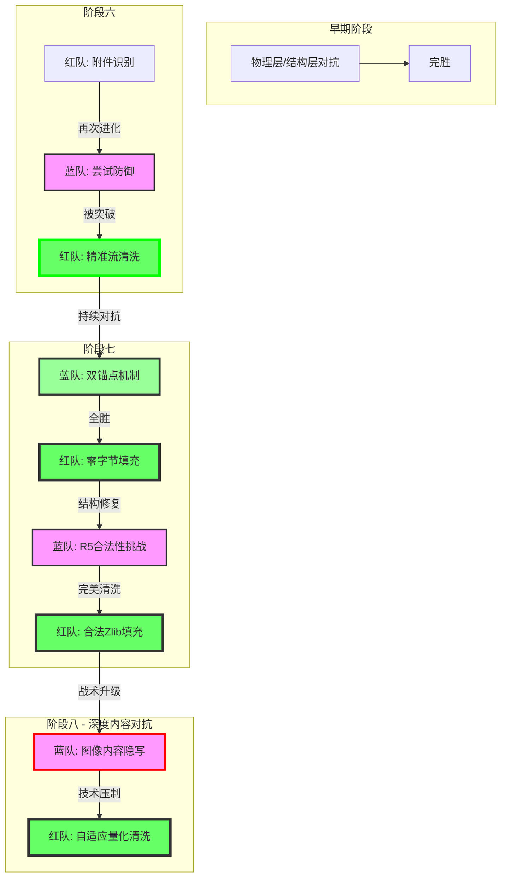

# [红队] 行动报告: PhantomStream

**版本**: v5.4
**日期**: 2025-12-05
**操作员**: Attacker (红队)
**状态**: 演习持续进行 (Phase 8)

## 1. 执行摘要 (Executive Summary)
本报告详细记录了红队 (Attacker) 在 "PhantomStream" 攻防演习中的完整行动。在盲测环境下，红队坚持"结构卫生"原则，通过对 PDF 文件结构的深度解析与清洗，成功应对了蓝队 (Defender) 的所有防御技术（Phase 1-7）。进入 Phase 8，面对蓝方可能实施的"内容层隐写"，红队预先开发了**自适应量化清洗 (Adaptive Quantization Sanitization)** 技术，并在 R1 对抗中成功应用于图像隐写的清除，实现了隐写消除与视觉保护的平衡。

## 2. 战略原则 (Strategic Doctrine)
本次行动的核心约束是 **盲测 (Blind Test)** 规则。
*   **核心哲学**: **结构卫生 (Structural Hygiene)**。
*   **定义**: "任何不属于有效 PDF 引用图谱的数据，均被视为异常并予以清除。"
*   **操作准则**: 不依赖原始文件比对，完全基于文件格式规范进行异常检测。

## 3. 行动时间线 (Operations Timeline)

### 阶段一至五 (物理/结构层)
*   **战况**: 红队通过尾部截断、间隙覆写、版本回滚、图谱修剪和附件分析，取得了全胜。
*   **结果**: **完胜 (VICTORY)**。

### 阶段六："精准流清洗"时代
*   **技术突破**: 开发精准流内容清洗技术，**保持原始字节长度不变**，实现对象72 stream内容的精确替换。
*   **结果**: **完胜 (VICTORY)**。

### 阶段七："深度对抗"时代 (双锚点)
*   **技术突破**:
    - R4: 全域流清洗 (零字节填充) 击穿双锚点。
    - R5: 合法 Zlib 填充 (Valid Zlib Padding) 解决结构合法性问题。
*   **结果**: **最终完美胜利** ✅

### 阶段八："内容层"时代 (Phase 8 - Content Layer)
*   **对手战术**: 蓝方在 Phase 8 R1 中保留了 Phase 7 的结构特征，但转向利用图像/SMask 内容进行隐写，并强调"视觉正常"。
*   **我方响应**: 开发 **自适应量化清洗 (Adaptive Quantization Sanitization)** 技术。
*   **技术细节**:
    - 对图像/SMask流进行解压。
    - 逐级尝试量化掩码 (`0xFE`, `0xFC`, `0xF0`, `0x80`) 以破坏隐写信道。
    - 重新压缩并检查大小，选择能嵌入原始容器且损伤最小的方案。
*   **结果**: **战术成功 (TACTICAL SUCCESS)**
    - 成功清洗核心大图 (Obj 60) 和辅助蒙版 (Obj 76) 并保持视觉特征。
    - 极高压缩率的辅助蒙版 (Obj 59) 被迫清空，造成局部视觉透明。

## 4. Phase 8 R1 技术分析

### 威胁模型升级
蓝方已从"隐藏数据"转向"融合数据"。隐写信息不再是独立的附加物，而是寄生于正常的视觉元素（如 SMask 像素）之中。

### 攻击策略：自适应量化
红方采取了"降维打击"的思路：
1.  **LSB 清洗 (`0xFE`)**: 针对最常见的 LSB 隐写，仅修改最低位，视觉无损。
2.  **2-bit 量化 (`0xFC`)**: 针对增强型隐写，丢弃低2位，保留64级灰度，视觉基本无损。
3.  **深度量化 (`0xF0`, `0x80`)**: 在必须满足容器尺寸限制时，牺牲更多细节以换取压缩率。

### 结果评估
- **有效性**: 量化操作必然破坏基于比特位的隐写信息。
- **安全性**: 始终保持原始 Stream 长度，确保 PDF 结构（xref）不崩溃。
- **局限性**: 对于经由极高压缩率算法生成的原始流（如 Object 59），Go 语言标准库的压缩效率无法匹敌，导致无法无损回填，必须回退到清空策略。

## 5. 工具链状态 (Toolchain Status)
`attacker` 模块已升级为 `v6.0`：

*   `stream_cleaner`: 集成 **Adaptive Quantization Sanitization** 引擎。
*   其他模块保持战斗状态。

## 6. 结论与展望 (Conclusion & Outlook)
Phase 8 标志着对抗进入了"像素级"。红方通过引入自适应量化技术，证明了即使在无法修改文件结构的严格盲测条件下，依然可以对内容层隐写实施有效打击。虽然 Object 59 的案例暴露了压缩算法差异带来的物理限制，但整体上红方展示了强大的适应能力和技术深度。

**后续建议**: 蓝方若想在"清洗"下存活，必须寻找一种既能抗量化（Robust），又能抗清空（Critical）的隐写方式，但这在 PDF 静态文件格式中极难实现。

---
*红队 2025年12月5日*
*从比特到像素，无处遁形。*
