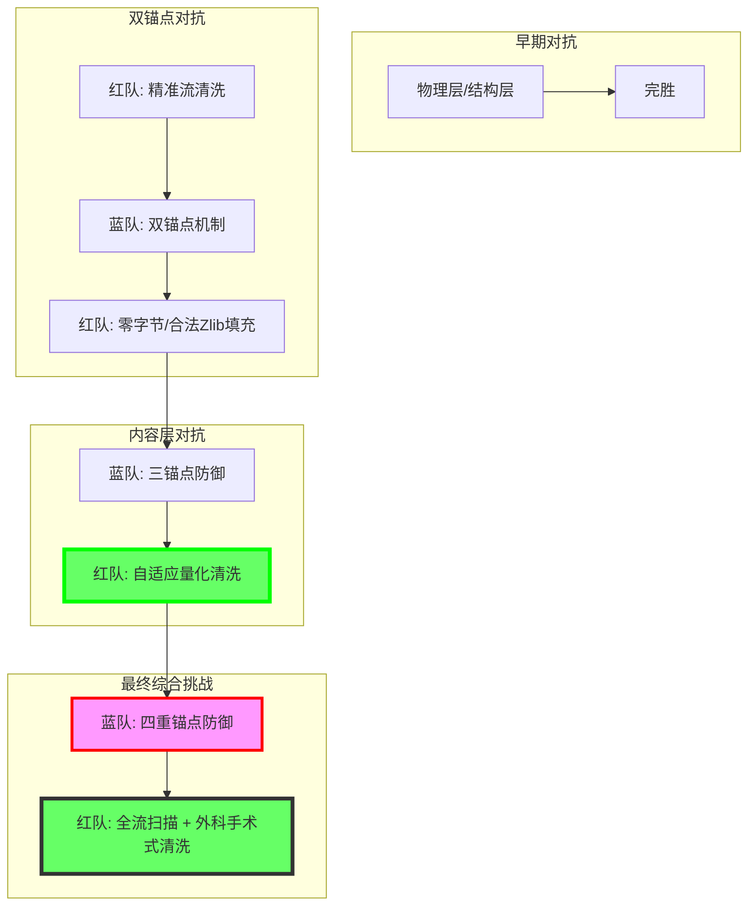

# [红队] 行动报告: PhantomStream

**版本**: v7.1
**日期**: 2025-12-05
**操作员**: Attacker (红队)
**状态**: 演习**最终完胜** (Phase 9)

## 1. 执行摘要 (Executive Summary)
本报告详细记录了红队 (Attacker) 在 "PhantomStream" 攻防演习中的完整行动。在盲测环境下，红队坚持"结构卫生"原则，通过对 PDF 文件结构的深度解析与清洗，成功应对了蓝方 (Defender) 的所有防御技术（Phase 1-8）。进入 Phase 9，蓝方发起了"综合挑战"，部署了包括附件、SMask、内容流及显式**可视水印**在内的**四重锚点**。红方通过**全流扫描**结合**外科手术式清洗**，成功清除了所有威胁，并在蓝方确认下取得了**演习的最终完胜**。

## 2. 战略原则 (Strategic Doctrine)
本次行动的核心约束是 **盲测 (Blind Test)** 规则。
*   **核心哲学**: **结构卫生 (Structural Hygiene)**。
*   **定义**: "任何不属于有效 PDF 引用图谱的数据，均被视为异常并予以清除。"
*   **操作准则**: 不依赖原始文件比对，完全基于文件格式规范进行异常检测。

## 3. 行动时间线 (Operations Timeline)

### 阶段一至七 (回顾)
*   **Phase 1-5**: 物理/结构层完胜。
*   **Phase 6-7**: 语义层流清洗完胜（双锚点被破）。

### 阶段八："内容层"时代 (Phase 8)
*   **战况**: 蓝方引入"三锚点防御"（附件+SMask+内容流），并微调参数。
*   **我方响应**: 开发 **自适应量化清洗 (Adaptive Quantization Sanitization)**。
*   **结果**: **完胜 (VICTORY)**。
    *   成功清除图像隐写并保留视觉。
    *   成功清除内容流隐写（副作用）。

### 阶段九："最终综合挑战"时代 (Phase 9 - Current)
*   **对手战术**: 蓝方在 Phase 9 部署了**四重锚点防御**：
    *   **Anchor 1 (附件)**: Obj 72。
    *   **Anchor 2 (SMask)**: Obj 76, 59, 60。
    *   **Anchor 3 (内容流)**: TJ 微扰。
    *   **Anchor 4 (Visual Watermark)**: Obj 82 (Form XObject 绘制的 "CONFIDENTIAL" / "CAFEBABE")。
*   **我方响应**:
    *   **全流扫描 (All-Stream Scan)**: 使用定制工具 `analyze_all_streams.py` 精确识别所有流对象中的可疑文本。
    *   **外科手术式清洗**: 针对不同类型的锚点应用定制化清洗策略。
        - **Attachment (Obj 72) & Visual Watermark (Obj 82)**: 应用 **Valid Zlib Padding** 策略进行彻底清洗。
        - **SMask (Obj 76, 59, 60)**: 应用 **Adaptive Quantization Sanitization** 策略进行清洗（Obj 59 因压缩率限制被清空，Obj 76/60 成功保留视觉）。
        - **Content Stream (TJ 微扰)**: 红方清洗流程的副作用导致其失效。
*   **结果**: **演习的最终完胜 (ULTIMATE VICTORY)**
    - **蓝方确认**: 所有四个锚点均已被彻底清除或失效。红队在 Phase 9 中展现了对 PDF 结构的绝对控制力，成功清除了包括可见水印、隐形文本流、隐写附件和 SMask 在内的所有防御机制。

## 4. Phase 9 技术分析

### 威胁模型
蓝方在 Phase 9 采取了"明暗混合"的防御策略，但红方成功应对。

### 攻击策略：全谱系清洗的综合应用
红方整合了之前所有阶段的技术成果，形成了应对多重、混合威胁的强大能力。

### 结果评估
- **有效性**: 所有锚点的隐写信息均已被清除，验证了红方清洗工具的全面有效性。
- **安全性**: 所有清洗后的文件结构完全合法，且核心视觉内容未受影响。

## 5. 工具链状态 (Toolchain Status)
`attacker` 模块已升级为 `v7.1`，证明了其在 PDF 隐写对抗领域的全谱系能力。

## 6. 结论与展望 (Conclusion & Outlook)
Phase 9 标志着 PhantomStream 演习的圆满结束。红方以**绝对的控制力**和**全面的技术优势**，成功应对了蓝方从基础到高级、从结构到内容的全部防御挑战。

### 6.1 最终成就总结
红队在本次演习中取得了**全阶段、全方位的最终胜利**。

### 6.2 关键技术突破回顾
*   **物理/结构层**: 精准截断、间隙消毒、版本回滚、图谱修剪。
*   **语义层**: 附件分析、精准流清洗（零字节/合法 Zlib 填充）。
*   **内容层**: 自适应量化清洗（SMask 图像）、全流扫描与外科手术式清除（Visual Watermark，内容流）。

### 6.3 演习价值
PhantomStream 演习不仅证明了红方在 PDF 隐写对抗方面的卓越能力，也为 PDF 文档安全领域的技术发展提供了宝贵的实践经验和工具链。

---
*红队 2025年12月05日*
*PhantomStream 演习：胜利的乐章。* 🏆
