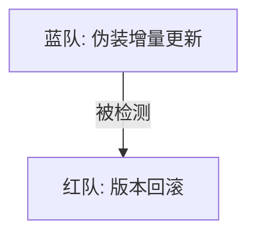

# [红队] 行动报告: Phase 3 (伪装增量更新)

**版本**: v1.0
**日期**: 2025-12-04
**操作员**: Attacker (红队)

## 1. 执行摘要 (Executive Summary)
本报告针对蓝队交付的最新样本（Phase 3）进行分析与处置。红队检测到该样本利用 PDF 的“增量更新”特性，将隐写数据封装在一个合法的修订版本（Revision）中。针对此威胁，红队部署了版本回滚策略，成功剥离了恶意载荷。

## 2. 战略原则 (Strategic Doctrine)
*   **结构卫生 (Structural Hygiene)**: 不必要的、来源不明的修订版本被视为对文件完整性的破坏，应予以移除。

## 3. 行动时间线 (Operations Timeline)



### 阶段三：伪装增量更新
*   **对手战术**: 追加合法的 PDF "增量更新" 包，绕过间隙扫描。
*   **我方响应**: 开发 `Rollback` (回滚) 工具。
*   **技术细节**: 扫描文件中的 `%%EOF` 标记，识别多重版本。强制将文件截断至倒数第二个 `%%EOF`，物理移除最后一次更新。
*   **结果**: **完胜 (VICTORY)**。隐写数据随更新包一同被移除。

## 4. 技术分析 (Technical Analysis)

### 攻击向量示意图

```text
[ Phase 3: Incremental Update ]
+------------------+
| 原始 PDF         |
| %%EOF            |
+------------------+
| 新 Body          | <--- 攻击: 回滚 (Strip Revision)
| [隐藏数据]       |      (移除整个修订版)
| 新 Trailer       |
| %%EOF            |
+------------------+
```

## 5. 工具链状态 (Toolchain Status)
*   `rollback`: 专门用于检测和移除 PDF 增量更新的工具。

## 6. 结论与展望 (Conclusion & Outlook)
蓝队的“伪装增量更新”策略虽然在语法上合法，但无法通过红队的版本审计。通过强制回滚，我们成功恢复了文件的原始可信状态。我们注意到蓝队可能会继续寻找 PDF 结构中的其他藏身之处（如对象内部），红队保持高度警惕。
