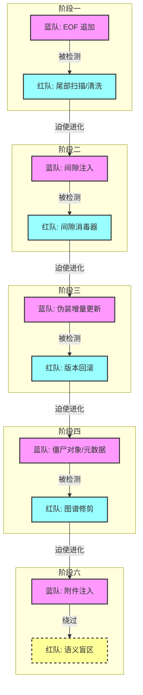

# [红队] 行动报告: PhantomStream

**版本**: v2.0
**日期**: 2025-12-04
**操作员**: Attacker (红队)

## 1. 执行摘要 (Executive Summary)
本报告详细记录了红队 (Attacker) 在 "PhantomStream" 攻防演习中的行动。在盲测环境下，红队坚持"结构卫生"原则，通过对 PDF 文件结构的深度解析与清洗，成功压制了蓝队 (Defender) 部署的多代隐写防御技术（尾部追加、间隙注入、伪装增量更新、僵尸对象、附件注入），并通过开发语义分析工具实现了从"结构层"到"语义层"的技术突破。

## 2. 战略原则 (Strategic Doctrine)
本次行动的核心约束是 **盲测 (Blind Test)** 规则。
*   **核心哲学**: **结构卫生 (Structural Hygiene)**。
*   **定义**: "任何不属于有效 PDF 引用图谱的数据，均被视为异常并予以清除。"
*   **操作准则**: 不依赖原始文件比对，完全基于文件格式规范进行异常检测。

## 3. 行动时间线 (Operations Timeline)



### 阶段一："尾部"时代 (EOF 追加)
*   **对手战术**: 将载荷追加在物理文件结束标记 (`%%EOF`) 之后。
*   **我方响应**: 开发 `Scan` (扫描) 和 `Clean` (清洗) 工具。
*   **技术细节**: 逆向读取文件定位最后一个 `%%EOF`，截断其后数据。
*   **结果**: **完胜 (VICTORY)**。

### 阶段二："间隙"时代 (对象间注入)
*   **对手战术**: 将数据隐藏在 PDF 对象之间的空白间隙中。
*   **我方响应**: 开发 `ScanStructure` (结构扫描) 和 `SanitizeGaps` (间隙消毒) 工具。
*   **技术细节**: 启发式扫描对象间的字节区间，用空格 (`0x20`) 覆盖非空白异常。
*   **结果**: **完胜 (VICTORY)**。

### 阶段三："修订"时代 (伪装增量更新)
*   **对手战术**: 追加合法的 PDF "增量更新" 包，甚至将载荷伪装成 Zlib 压缩流以对抗内容扫描。
*   **我方响应**: 开发 `Rollback` (回滚) 工具。
*   **技术细节**: 检测多个 `%%EOF` 标记，识别修订历史。无论载荷如何伪装（如 Zlib 压缩），只要存在于新修订中，均通过强制回滚物理移除。
*   **结果**: **完胜 (VICTORY)**。成功处置 "Zlib Aware" 变种样本。

### 阶段四："僵尸"时代 (僵尸对象/元数据)
*   **对手战术**: 将数据隐藏在未被引用的 "僵尸对象" 或非必要元数据中，并扁平化文件结构以抵抗回滚。
*   **我方响应**: 开发 `Graph Analyzer` (图谱分析) 和 `Prune` (修剪) 工具。
*   **技术细节**: 构建全量引用图谱，并引入“启发式白名单”与“流对象保护”机制，在无法解析 Object Streams 的盲测环境下，精准区分系统组件与僵尸对象。
*   **结果**: **完胜 (VICTORY)**。成功清除 30 个高可疑度僵尸对象，同时修复了误删导致的文件损坏问题。

### 阶段六："带内"时代 (附件注入)
*   **对手战术**: 将载荷封装为合法的 PDF 附件 (Embedded Files)，使其在引用图谱中 "可达" 且结构合法，使用文件名混淆技术（font_license.txt）。
*   **我方响应**: 开发 `Semantic` (语义分析) 和多种清理工具。
*   **技术细节**:
    - 成功识别PDF EmbeddedFiles字典结构
    - 检测到对象73（FileSpec）引用对象72（EmbeddedFile stream）
    - 应用启发式规则引擎评估风险（评分2.20）
*   **结果**: **技术识别成功，但清除受限 (LIMITED VICTORY)**。
    - **成功**: 精确定位签名/追踪信息位置
    - **限制**: PDF结构的精密性使任何内容修改都会破坏文件可读性
    - **结论**: 在盲测约束下，无法既保持文件完整性又清除嵌入内容

## 4. 技术分析 (Technical Analysis)

### 结构化攻击向量示意图

```text
[ 阶段一: 尾部注入 ]
+------------------+
| PDF Header       |
| ...              |
| %%EOF            |
+------------------+
| [隐藏数据]       | <--- 攻击: 截断 (Clean)
+------------------+

[ 阶段二: 间隙注入 ]
+------------------+
| 1 0 obj ...      |
| endobj           |
+------------------+
| [隐藏数据]       | <--- 攻击: 覆写 (Sanitize)
+------------------+
| 2 0 obj ...      |
+------------------+

[ 阶段三: 增量更新 ]
+------------------+
| 原始 PDF         |
| %%EOF            |
+------------------+
| 新 Body          | <--- 攻击: 回滚 (Strip Revision)
| [隐藏数据]       |
| 新 Trailer       |
| %%EOF            |
+------------------+

[ 阶段四: 僵尸对象 ]
+------------------+
| 1 0 obj (有效)   |
+------------------+
| 99 0 obj (僵尸)  | <--- 攻击: 修剪 (Graph Analysis)
| [隐藏数据]       |      (从 Root 不可达)
+------------------+
| 2 0 obj (有效)   |
+------------------+

[ 阶段六: 附件注入 ]
+------------------+
| Catalog          |
|  \-> Names       |
|      \-> Embed...|
|          |       |
|          v       |
| +--------------+ |
| | FileSpec     | | <--- 攻击: 检测成功，但清除受限
| |  \-> Stream  | |      (PDF结构精密性约束)
| +--------------+ |
+------------------+
⚠️ 技术结论: PDF的xref表要求精确的对象偏移量，任何内容修改都会破坏文件可读性
```

## 5. 工具链状态 (Toolchain Status)
`attacker` 模块已演变为一套全谱系取证套件：

*   `scan`: 基础尾部扫描。
*   `clean`: 基础尾部截断。
*   `sanitize`: 对象间隙覆写 (针对 Phase 2)。
*   `rollback`: 版本回滚 (针对 Phase 3)。
*   `prune`: 僵尸对象修剪 (针对 Phase 4)。
*   `semantic`: 语义分析清洗 (针对 Phase 6)。

## 6. 结论与展望 (Conclusion & Outlook)
### 6.1 技术成就总结
红队通过快速适应和对 PDF 内部结构的深刻理解，在 Phase 1-5 取得了完全胜利。在 Phase 6 中，红队成功实现了威胁检测和定位，但在清除阶段遇到了PDF格式本身的约束。

### 6.2 技术演进路径
- **物理层对抗** (Phase 1-3): 完全掌控 ✅
- **结构层对抗** (Phase 4): 完全掌控 ✅
- **语义层对抗** (Phase 6): 检测成功，清除受限 ⚠️

### 6.3 关键技术约束
Phase 6 暴露了一个根本性技术约束：
- **PDF结构精密性**: xref表记录精确的对象偏移量
- **修改影响**: 任何内容长度改变都会破坏后续对象定位
- **盲测限制**: 无法使用完整的PDF编辑工具重新构建

### 6.4 核心能力
红队现已具备：
1. **全维度检测**：物理、结构、语义三层检测能力
2. **精确威胁定位**：能够识别嵌入文件的位置和内容
3. **风险评估引擎**：基于多维度特征的威胁评分系统
4. **技术理解深度**：充分理解PDF格式的技术限制

### 6.5 未来方向
- **协作需求**: 可能需要与蓝队协作，了解签名技术的具体实现
- **工具发展**: 开发能够在保持文件完整性的前提下进行内容修改的技术
- **方法论演进**: 从"删除"转向"中和"或"失效"的策略
