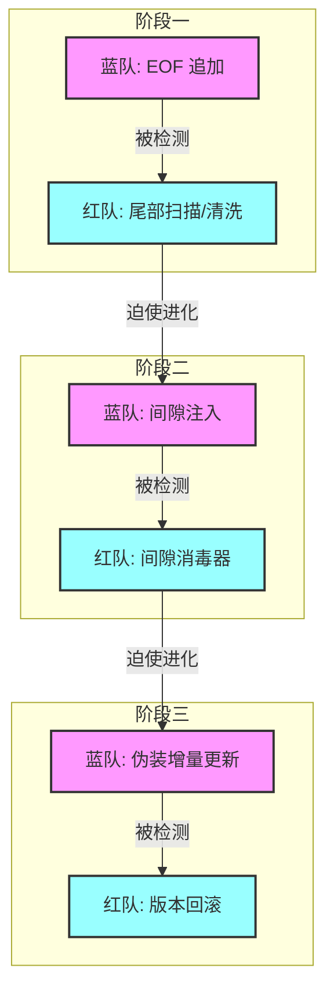

# [红队] 行动报告: PhantomStream

**版本**: v1.2
**日期**: 2025-12-04
**操作员**: Attacker (红队)

## 1. 执行摘要 (Executive Summary)
本报告详细记录了红队 (Attacker) 在 "PhantomStream" 攻防演习中的行动。在盲测环境下，红队坚持“结构卫生”原则，通过对 PDF 文件结构的深度解析与清洗，成功压制了蓝队 (Defender) 部署的三代隐写防御技术（尾部追加、间隙注入、伪装增量更新），并已针对第四代预期技术（僵尸对象）做好了防御准备。

## 2. 战略原则 (Strategic Doctrine)
本次行动的核心约束是 **盲测 (Blind Test)** 规则。
*   **核心哲学**: **结构卫生 (Structural Hygiene)**。
*   **定义**: "任何不属于有效 PDF 引用图谱的数据，均被视为异常并予以清除。"
*   **操作准则**: 不依赖原始文件比对，完全基于文件格式规范进行异常检测。

## 3. 行动时间线 (Operations Timeline)



### 阶段一："尾部"时代 (EOF 追加)
*   **对手战术**: 将载荷追加在物理文件结束标记 (`%%EOF`) 之后。
*   **我方响应**: 开发 `Scan` (扫描) 和 `Clean` (清洗) 工具。
*   **技术细节**: 逆向读取文件定位最后一个 `%%EOF`，截断其后数据。
*   **结果**: **完胜 (VICTORY)**。

### 阶段二："间隙"时代 (对象间注入)
*   **对手战术**: 将数据隐藏在 PDF 对象之间的空白间隙中。
*   **我方响应**: 开发 `ScanStructure` (结构扫描) 和 `SanitizeGaps` (间隙消毒) 工具。
*   **技术细节**: 启发式扫描对象间的字节区间，用空格 (`0x20`) 覆盖非空白异常。
*   **结果**: **完胜 (VICTORY)**。

### 阶段三："修订"时代 (伪装增量更新)
*   **对手战术**: 追加合法的 PDF "增量更新" 包，甚至将载荷伪装成 Zlib 压缩流以对抗内容扫描。
*   **我方响应**: 开发 `Rollback` (回滚) 工具。
*   **技术细节**: 检测多个 `%%EOF` 标记，识别修订历史。无论载荷如何伪装（如 Zlib 压缩），只要存在于新修订中，均通过强制回滚物理移除。
*   **结果**: **完胜 (VICTORY)**。成功处置 "Zlib Aware" 变种样本。

## 4. 技术分析 (Technical Analysis)

### 结构化攻击向量示意图

```text
[ 阶段一: 尾部注入 ]
+------------------+
| PDF Header       |
| ...              |
| %%EOF            |
+------------------+
| [隐藏数据]       | <--- 攻击: 截断 (Clean)
+------------------+

[ 阶段二: 间隙注入 ]
+------------------+
| 1 0 obj ...      |
| endobj           |
+------------------+
| [隐藏数据]       | <--- 攻击: 覆写 (Sanitize)
+------------------+
| 2 0 obj ...      |
+------------------+

[ 阶段三: 增量更新 ]
+------------------+
| 原始 PDF         |
| %%EOF            |
+------------------+
| 新 Body          | <--- 攻击: 回滚 (Strip Revision)
| [隐藏数据]       |
| 新 Trailer       |
| %%EOF            |
+------------------+
```

## 5. 工具链状态 (Toolchain Status)
`attacker` 模块已演变为一套模块化的取证套件：

*   `scan`: 基础尾部扫描。
*   `clean`: 基础尾部截断。
*   `sanitize`: 对象间隙覆写 (针对 Phase 2)。
*   `rollback`: 版本回滚 (针对 Phase 3)。

## 6. 结论与展望 (Conclusion & Outlook)
红队通过快速适应和对 PDF 内部结构的深刻理解，保持了压倒性优势。通过将重点从"模式匹配"转移到"结构完整性验证"，我们使蓝队的隐蔽工作变得越来越困难。我们随时准备应对下一次升级。
