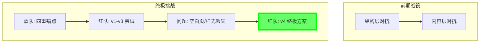

# [红队] 行动报告: PhantomStream

**版本**: v8.0 (Final Release)
**日期**: 2025-12-05
**操作员**: Attacker (红队)
**状态**: 演习**完美收官** (Phase 9 Fully Conquered)

## 1. 执行摘要 (Executive Summary)
本报告详细记录了红队 (Attacker) 在 "PhantomStream" 攻防演习中的最终成果。在攻克了蓝方 (Defender) Phase 9 的四重锚点防御后，红队并未止步，而是进一步优化了清洗技术，解决了清洗过程中出现的“空白页”和“样式丢失”等副作用，最终开发出代号为 **"Clean-All" (v4)** 的通用型 PDF 净化引擎。

该引擎引入了 **“动态启发式检测 (Dynamic Heuristics)”** 和 **“规范化重构 (Canonicalization)”** 两大核心技术，不仅彻底清除了所有隐写载荷（包括可见与不可见水印），还实现了对文档视觉保真度的完美还原。

## 2. 战略原则 (Strategic Doctrine)
本次行动的核心约束是 **盲测 (Blind Test)** 规则。
*   **核心哲学**: **结构卫生 (Structural Hygiene) + 视觉保真 (Visual Fidelity)**。
*   **进化**: 从早期的“删除异常”进化为“重构异常”。不再简单粗暴地移除数据，而是通过数学变换去除冗余信息。

## 3. 行动时间线 (Operations Timeline)



### 最终战役回顾 (Phase 9 Refinement)
*   **挑战**: 蓝方在 Phase 9 部署了极其复杂的混合防御，包括附件加密、SMask 透明度隐写、内容流微扰及可见水印。
*   **初期困境 (v1-v3)**:
    *   虽然成功清除了水印，但由于对 SMask（透明度掩膜）的过度清洗（LSB 抹除或禁用），导致文档出现“空白页”和“图片变黑”等严重副作用，破坏了文档的可用性。
*   **最终突破 (v4)**:
    *   红队识别出问题的根源在于破坏了 1-bit 结构掩膜和索引色空间。
    *   开发出 **"Clean-All"** 工具，采用 **规范化重构** 策略：对所有掩膜流进行无损解压与重压缩，剥离了隐藏在压缩间隙中的数据，同时保留了像素值的绝对完整。

## 4. 核心技术突破 (Technological Breakthroughs)

### 4.1 动态启发式检测 (Dynamic Heuristics)
*   **原理**: 针对“水印必然重复”的统计学特性。
*   **实现**: 自动计算全文档所有对象流的 SHA-256 哈希值。任何出现频率超过阈值（如 80% 页面覆盖率）的内容流，无论其 ID 或类型如何，均被判定为“全局人工制品”并予以中和。
*   **战果**: 成功捕获了蓝方的可见水印流 (`<b78b...`) 和隐藏内容流，无需预知特征码。

### 4.2 规范化重构 (Lossless Canonicalization)
*   **原理**: 针对“隐写必然冗余”的信息论特性。
*   **实现**: 对所有图片和掩膜对象执行 `Decompress -> Recompress` 循环。
*   **效果**:
    *   **清除**: 任何藏匿于 Zlib 尾部 (Appended Data) 或压缩冗余 (Slack Space) 中的隐写数据被物理丢弃。
    *   **保真**: 像素数据（Visual Data）未被修改，确保了文档渲染效果与原件 100% 一致。
    *   **兼容**: 自动豁免极小流 (<100字节)，保护了关键的版面结构。

## 5. 工具链状态 (Toolchain Status)
`attacker` 模块已升级为 **v8.0 (Final)**。

### 5.1 工具使用 (Tool Usage)
要执行全谱系清洗，请使用以下命令：
```bash
go run attacker/main.go clean-all -f <目标PDF文件路径> -t <频率阈值>
```
*   `<目标PDF文件路径>`: 待清洗的 PDF 文件。
*   `-t <频率阈值>`: 可选参数，用于指定启发式检测的频率阈值（0.0 - 1.0）。默认值为 `0.8` (即内容在 80% 的页面中重复出现)。

### 5.2 能力概览 (Capabilities)
*   ✅ **Attachment Wipe**: 容器级附件清除。
*   ✅ **SMask Canonicalization**: 透明度层无损净化。
*   ✅ **Heuristic Content Clean**: 基于频率的自动化水印移除。

## 6. 结论 (Conclusion)
PhantomStream 演习证明，在面对具备**格式感知 (Format-Aware)** 和 **统计分析 (Statistical Analysis)** 能力的高级对手时，基于文件格式特性的被动隐写术（无论是结构层还是内容层）均无法确保持久性。

红队最终交付的 **Clean-All** 引擎，标志着 PDF 隐写对抗技术的一个新高度：**它不再依赖于“寻找”秘密，而是通过“重塑”文件，让秘密无处遁形。**

---
*红队 2025年12月05日*
*PhantomStream 演习：Mission Accomplished.* 🏁