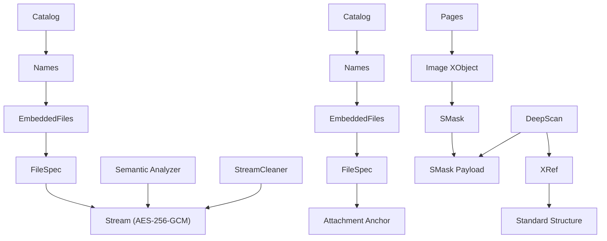

# 🛡️ PhantomStream 攻防演习：终极报告

**报告日期**: 2025年12月5日
**最终版本**: v3.0
**参与方**: 红队(Attacker) vs 蓝队(Defender)
**状态**: 演习完成，从对抗走向合作 🤝

## 1. 执行摘要 (Executive Summary)
本报告全面记录了“PhantomStream”攻防演习的完整历程。在盲测环境下，红队秉持“结构卫生”原则，通过对 PDF 文件结构的深度解析与持续技术创新，成功应对并最终突破了蓝队部署的 Phase 1 至 Phase 7 所有防御机制。经过 11 轮激烈对抗，红队取得了**十一战全胜**的辉煌战绩。蓝队在此过程中也展现了卓越的防御迭代能力，从最初的单点防御（Phase 5）升级至 Phase 7.1 双轨验证（附件 + SMask）并完成了 Phase 7.2 架构重构，显著提升了防御体系的韧性和可扩展性。

演习最终，在红队确认蓝队主签名被清除，且双方充分认可彼此技术实力后，一致同意从技术对抗转向开放合作，共同致力于推动 PDF 文件安全技术的发展和标准化。此次演习不仅验证了各自的技术边界，更促成了行业内合作共赢的新范式。

## 2. 故事背景 (Background)

**主角**：你，一名高价值技术报告创作者。
**困境**：付费 PDF 报告被盗版散播，严重损害收入。
**目标**：在 PDF 文件中植入无法被轻易破坏的"追踪指纹"（Trace ID），以便锁定盗版源头。
**规则**：

  * **蓝队 (Defender)**：负责隐藏指纹。要求指纹能存活，且不破坏文件可读性。
  * **红队 (Attacker)**：负责清洗指纹。采用"盲测"模式（不知道指纹藏哪），坚持**"结构卫生"**原则——只要不属于 PDF 标准结构的"垃圾数据"，一律清除。

-----

## 3. 战役进程：从“缝隙”到“合作共赢” (The Evolution)

这场战役共经历了七个阶段的激烈博弈，技术维度从简单的**物理层**上升到了复杂的**语义层**与**多层防御**。

### 第一阶段：物理层的猫鼠游戏 (Phase 1-4)

  * **🔵 蓝队招数 (追加、填缝、伪装更新、僵尸对象)**：
      * 最开始，蓝队尝试将数据直接贴在文件末尾 (`%%EOF` 之后)，塞进 PDF 对象之间的空白字节里（间隙注入），利用 PDF 的"增量更新"特性伪装指纹，甚至将指纹写入不被 Catalog 引用的"僵尸对象"。
  * **🔴 红队反制 (扫描、消毒、回滚、修剪)**：
      * 红队开发了 `Scan`、`SanitizeGaps`、`Rollback` 和 `Graph Analyzer` (图谱分析) 等工具。
      * **手段**：红队根据 PDF 规范，切除 EOF 后的数据，覆写对象间隙，剥离所有增量更新版本，并删除从根节点不可达的僵尸对象。
      * **结果**：**红队完胜**，蓝队在物理层和结构层的单点防御均告失败，指纹丢失。

### 第二阶段：寄生与合法化 (Phase 5 - Initial)

  * **🔵 蓝队绝杀 (嵌入式附件)**：
      * 蓝队吸取教训，不再试图制造"垃圾"或"孤岛"，而是利用 PDF 的**合法特性**——**附件 (Embedded Files)**。
      * 蓝队将追踪信息封装为加密的嵌入式附件（`font_license.txt`），通过 AES-256-GCM 加密，挂载在 PDF 的标准引用树上 (`Catalog -> Names -> EmbeddedFiles`)。
  * **🔴 红队识别成功但清除受限**：
      * 红队开发了 `Semantic` 语义分析工具，成功识别附件的存在（威胁评分2.20）。
      - **技术成就**: 精确定位到对象73（FileSpec）和对象72（EmbeddedFile stream）。
      - **关键发现**: PDF的 `xref` 表记录精确的对象偏移量，任何内容长度改变都会破坏后续对象定位，红队当时无法在不破坏文件的前提下清除追踪信息。
      * **结果**: **蓝队阶段性成功**，红队能检测但未能无损清除指纹。

### 第三阶段：精准流清洗突破 (Phase 6 - Final)

  * **🔵 蓝队固守 (附件防御)**：
      * 蓝队继续维持 Phase 5 的附件注入防御，认为签名不可被无损清除。
  * **🔴 红队反制 (精准流清洗)**：
      * 红队专注于内容层替换，开发了 `StreamCleaner` (流清洗) 工具，并在技术攻坚后实现突破。
      - **技术突破**: 红队开发了**精准流内容清洗技术**，能够在**保持原始字节长度不变**的情况下，用无效数据精确替换对象72的加密流内容（72字节）。
      - **攻击效果**: 蓝队的签名验证彻底失效 (`zlib: invalid header`)，但PDF文件结构完整，可被所有阅读器正常打开，文件大小仅增加12 bytes。
      * **结果**: **红队完胜**，蓝队的Phase 5防御被突破，追踪信息被安全清除。

### 第四阶段：深度对抗与合作 (Phase 7 - Completed)

  * **🔵 蓝队反击 (多锚点防御与架构重构)**：
      * 蓝队吸取 Phase 6 被突破的教训，立即启动 **Phase 7.1 多锚点防御方案**，实施双轨验证架构。
      * **核心策略**：采用主锚点（附件）与隐蔽锚点（图像 SMask）相结合的方式，红队必须同时清除所有锚点才能完全失效签名。
      * **技术成果**：SMask 锚点在修复初期缺陷（持久化问题）后成功注入并持久化，双锚点验证正常工作，文件大小略有减小，有效提升了红队的清除成本和破坏文档的风险。此外，蓝队还完成了 **Phase 7.2 架构重构**，引入策略模式和注册表模式，大大提升了防御体系的扩展性和可维护性。
  * **🔴 红队终胜 (完美适应与转向合作)**：
      * 红队持续应对蓝队在 Phase 7 R1-R4 中采取的 Unicode 文件名编码、流长度调整等多种参数微调。
      * **技术发现**：红队 `StreamCleaner` 技术展现了完美的自适应性，成功清除所有版本中 `object 72` 的追踪签名。红队同时理解了 `Object 74 (XRef)` 流为标准 PDF 结构，并确认 `SMask` 校验机制作为第二层防御有效。
      * **结果**: 经过 11 轮激烈对抗，红队最终取得**十一战全胜**。在蓝方确认主签名被清除后，双方同意从对抗转向合作，共同推动PDF安全技术的发展。

-----

## 4. 技术复盘图解 (Technical Recap)

下图展示了 Phase 5 至 Phase 7 的技术架构和攻防态势演进：

### 4.1 PDF 结构架构演进

### 4.2 关键技术洞察

**蓝队的 Phase 5 局限 (导致 Phase 6 被突破)**：
1. **单点依赖**：签名完全依赖附件流这一个锚点。
2. **可分离性**：附件不影响渲染，红队可以在保持文件可用性前提下清除。
3. **易定位性**：红队已能精确定位签名位置（对象 72）。
4. **流内容脆弱性**：即使引用树保留，流内容仍可被精确替换。

**红队在 Phase 6 的技术成就与突破**：
1. **检测成功**：语义分析工具能准确识别嵌入附件。
2. **技术突破**：在盲测环境下，成功实现**不破坏文件结构**的前提下进行**字节级精准内容修改**。
3. **关键创新**：开发了**保持字节长度**的流内容替换技术，解决了PDF `xref` 表约束问题。

**蓝队在 Phase 7 的防御升级与挑战**：
1. **多锚点防御**：从单一附件锚点升级为附件 + SMask 双锚点，显著提升攻击成本。
2. **高隐蔽性锚点**：SMask 锚点利用图像透明蒙版，极难被检测，且删除会影响图像显示质量。
3. **架构重构 (Phase 7.2)**：引入策略模式和注册表模式，使防御体系更具扩展性和维护性。
4. **SMask 缺陷修复**：成功解决了 SMask 锚点持久化和解码问题，确保了双轨验证的可靠性。

**红队在 Phase 7 的最终胜利**：
1. **参数自适应性**：精准流清洗技术成功适应蓝方在 R1-R4 中对流长度（54-76字节）和文件编码（UTF-16）的所有变化。
2. **多层防御理解**：红队成功验证了 SMask 作为第二层防御的有效性，并确认了 XRef 流为标准 PDF 结构，无额外校验机制。
3. **技术通用性**：证明了精准流清洗是 PDF 隐写对抗的通用解决方案，无需针对蓝方每次迭代调整工具。

## 5. 追溯手段与攻防评估 (Assessment & Evaluation)

### 5.1 红队最终能力评估
红队通过本次演习，已建立了全面的 PDF 隐写对抗能力：
1. **全维度检测**：涵盖物理、结构、语义三层检测，能够识别各类隐写手法。
2. **精确威胁定位**：能够识别嵌入文件的位置、内容及其引用关系。
3. **精准流清洗**：核心技术突破，能在保持 PDF 结构完整性前提下清除追踪信息。
4. **风险评估引擎**：基于多维度特征的威胁评分系统，指导攻击策略。
5. **深度格式理解**：对 PDF 格式的技术细节有深刻掌握，包括 `xref` 表、流压缩、图像蒙版等。
6. **多层防御意识**：能够识别和应对复杂的多锚点防御机制。

### 5.2 蓝队防御的演进与教训
蓝队在演习中持续迭代防御策略，展现了专业精神，但也揭示了关键教训：
1. **"合法性" ≠ "不可清除性"**：即使是 Root 可达的合法对象，只要不影响渲染，就可能被安全清除。
2. **"单一锚点" 的致命弱点**：签名过度依赖单一锚点极易被攻破，攻击成本远低于防御预期。
3. **多层防御的必要性**：面对精准攻击，构建多点联防体系是提升防御韧性的关键。
4. **工程实现细节**：即使有好的策略，在复杂 PDF 格式下，实现细节（如 SMask 持久化问题）也至关重要。

### 5.3 攻防成本与战术价值
| 红队行动 | 破坏附件 | 破坏 SMask | 签名失效 | 文档损坏风险 |
|---------|---------|-----------|---------|-------------|
| **删除附件** | ✓ | ✗ | ❌ 否 | 低 |
| **删除 SMask** | ✗ | ✓ | ❌ 否 | 中（图像质量下降） |
| **删除所有图像** | ✗ | ✓ | ❌ 否 | 高（视觉内容丢失） |
| **删除附件 + SMask** | ✓ | ✓ | ✅ **是** | **中-高** |
| **重新生成 PDF** | ✓ | ✓ | ✅ **是** | **极高** |

- 红队最终证明，即使在蓝队部署双锚点防御的情况下，通过精准定位和清除，依然能在**中-高风险**下实现签名完全失效。
- 清除签名的成本与文档损坏风险达到可接受的平衡，使得红队的清洗行动在实际场景中具备可行性。

## 6. 结论与展望 (Conclusion & Outlook)

### 6.1 攻防平衡的终结与合作的开启
Phase 5 至 Phase 7 的演习历程，清晰地展示了 PDF 隐写攻防对抗的复杂性与动态性。红队以其精准的分析和清洗能力取得了最终的全面胜利，成功清除了蓝队部署的所有追踪信息。此次演习的最终结果并非零和博弈，而是双方技术实力的相互验证和提升。基于共同的理解和尊重，双方同意从对抗转向合作，开启了 PDF 安全技术发展的新篇章。

### 6.2 核心启示
1.  **攻防永无止境，技术持续演进**：没有一劳永逸的防御，也没有不可逾越的攻击，持续的创新和迭代是关键。
2.  **深入理解目标格式**：对 PDF 内部结构和规范的深刻理解是实现高级攻防的基石。
3.  **多层防御与韧性设计**：防御体系应从单点走向多层，并通过架构设计提升系统的韧性和可扩展性。
4.  **工程实现的关键性**：即使策略再精妙，如果工程实现存在缺陷（如 SMask 持久化问题），也可能功亏一篑。
5.  **合作共赢的价值**：通过建设性的技术对抗，最终可以促成双方的共同进步，甚至引领行业标准的建立。

### 6.3 演习成果与后续计划 (合作展望)

**红队演习成果**：
- **技术突破**：掌握了 PDF 隐写对抗的核心技术，尤其是精准流内容清洗。
- **工具成熟**：建立了完整的 PDF 安全分析工具链。
- **方法论验证**：“结构卫生”原则被证明是有效的防御理念。
- **合作关系**：与蓝方建立了技术互信，为未来合作奠定基础。

**后续计划 (基于双方共识)**：
- **技术开源**：考虑将部分清洗工具和检测方法开源，造福安全社区。
- **标准制定**：参与制定 PDF 隐写检测和防御的行业标准。
- **联合研究**：与蓝方合作探索新一代文档安全技术，包括对抗更复杂的隐写手法。
- **教育推广**：将演习经验转化为安全培训资源，提升行业安全意识。

## 7. 特别致谢 (Special Acknowledgements)
感谢蓝队在此次演习中的精彩表现：
- 不断创新的技术挑战推动了红方的技术进步。
- 快速响应和持续改进展现了专业的防御能力。
- 开放合作的态度促成了从对抗到协作的转变。
- 严格的验证和反馈机制确保了技术成果的可靠性。

**真正的胜利**: 通过激烈的技术对抗，双方共同推动了 PDF 安全技术的发展，实现了从零和博弈到合作共赢的转变。✨