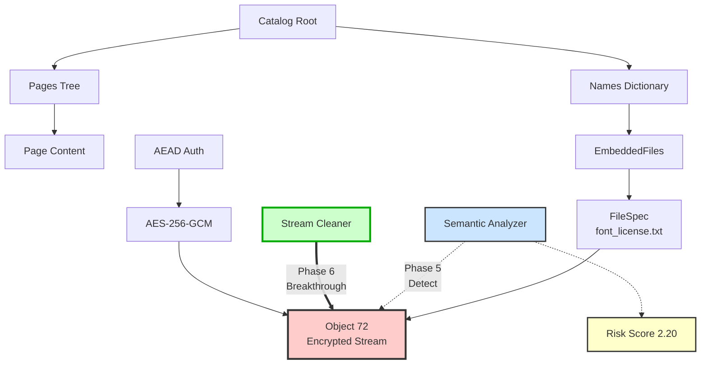

这是一个关于"矛与盾"进化的精彩故事。

-----

# 🛡️ 攻防演习复盘：PhantomStream 行动

**报告日期**: 2025年12月4日
**最终版本**: v1.0
**参与方**: 红队(Attacker) vs 蓝队(Defender)

## 1.故事背景 (Background)

**主角**：你，一名高价值技术报告创作者。
**困境**：付费 PDF 报告被盗版散播，严重损害收入。
**目标**：在 PDF 文件中植入无法被轻易破坏的"追踪指纹"（Trace ID），以便锁定盗版源头。
**规则**：

  * **蓝队 (Defender)**：负责隐藏指纹。要求指纹能存活，且不破坏文件可读性。
  * **红队 (Attacker)**：负责清洗指纹。采用"盲测"模式（不知道指纹藏哪），坚持**"结构卫生"**原则——只要不属于 PDF 标准结构的"垃圾数据"，一律清除。

-----

## 2.战役进程：从"缝隙"到"寄生" (The Evolution)

这场战役共经历了六个阶段的激烈博弈，技术维度从简单的**物理层**上升到了复杂的**语义层**。

### 第一阶段：物理层的猫鼠游戏 (Phase 1-2)

  * **🔵 蓝队招数 (追加与填缝)**：
      * 最开始，蓝队试图将数据直接贴在文件末尾 (`%%EOF` 之后)，或者塞进 PDF 对象之间的空白字节里（间隙注入）。
  * **🔴 红队反制 (扫描与消毒)**：
      * 红队开发了 `Scan` 和 `SanitizeGaps` 工具。
      * **手段**：红队不看内容，直接根据 PDF 规范，切掉 EOF 后面的尾巴，并用空格符 (`0x20`) 强制覆盖所有对象间的间隙。
      * **结果**：蓝队完败，指纹丢失。

### 第二阶段：时间维度的博弈 (Phase 3)

  * **🔵 蓝队招数 (伪装更新)**：
      * 蓝队利用 PDF 的"增量更新"特性，假装指纹是一次正常的文件修订，追加在文件末尾。为了躲避扫描，甚至伪装成了 Zlib 压缩流。
  * **🔴 红队反制 (时间回滚)**：
      * 红队祭出 `Rollback`（版本回滚）工具。
      * **手段**：不管你伪装得多好，红队直接识别并剥离所有"增量更新"版本，强行把文件还原到"出厂设置"。
      * **结果**：蓝队再次失败，指纹随着更新包被丢弃。

### 第三阶段：图谱结构的绞杀 (Phase 4)

  * **🔵 蓝队招数 (僵尸对象)**：
      * 蓝队将指纹写入标准的 PDF 对象（如 `99 0 obj`），但这些对象不被 PDF 的目录（Catalog）引用。这被称为"僵尸对象"——它们存在于文件中，但实际上是无用的。
  * **🔴 红队反制 (图谱修剪)**：
      * 红队开发了杀手级工具 `Graph Analyzer` (图谱分析)。
      * **手段**：从 PDF 的根节点（Root）出发，遍历所有引用的对象。凡是遍历不到的"孤岛对象"，全部视为僵尸并删除。
      * **结果**：蓝队植入的 30 个僵尸对象被精准清除。

### 第四阶段：寄生与合法化 (Phase 5 - Initial)

  * **🔵 蓝队绝杀 (嵌入式附件)**：
      * 蓝队吸取教训，不再试图制造"垃圾"或"孤岛"，而是利用 PDF 的**合法特性**——**附件 (Embedded Files)**。
      * 蓝队将追踪信息封装为加密的嵌入式附件（font_license.txt），通过 AES-256-GCM 加密，挂载在 PDF 的标准引用树上 (`Catalog -> Names -> EmbeddedFiles`)。
  * **🔴 红队识别成功但清除受限**：
      * 红队开发了 `Semantic` 语义分析工具，成功识别附件的存在（威胁评分2.20）。
      - **技术成就**: 精确定位到对象73（FileSpec）和对象72（EmbeddedFile stream）。
      - **关键发现**: PDF的xref表记录精确的对象偏移量，任何内容长度改变都会破坏后续对象定位，红队当时无法在不破坏文件的前提下清除追踪信息。
      * **结果**: **蓝队阶段性成功**，红队能检测但未能无损清除指纹。

### 决战阶段：精准清洗突破 (Phase 6 - Final)

  * **🔵 蓝队固守 (附件防御)**：
      * 蓝队继续维持 Phase 5 的附件注入防御，认为签名不可被无损清除。
  * **🔴 红队反制 (精准流清洗)**：
      * 红队专注于内容层替换，开发了 `StreamCleaner` (流清洗) 工具，并在技术攻坚后实现突破。
      - **技术突破**: 红队开发了**精准流内容清洗技术**，能够在**保持原始字节长度不变**的情况下，用无效数据精确替换对象72的加密流内容（72字节）。
      - **攻击效果**: 蓝队的签名验证彻底失效 (`zlib: invalid header`)，但PDF文件结构完整，可被所有阅读器正常打开，文件大小仅增加12 bytes。
      * **结果**: **红队完胜**，蓝队的Phase 5防御被突破，追踪信息被安全清除。

-----

## 3.技术复盘图解 (Technical Recap)

下图展示了 Phase 6 的技术架构和攻防态势：

### 3.1 PDF 结构架构

### 3.2 关键技术洞察

**蓝队的Phase 5局限 (导致 Phase 6 被突破)**：
1. **单点依赖**：签名完全依赖附件流这一个锚点
2. **可分离性**：附件不影响渲染，红队可以在保持文件可用性前提下清除
3. **易定位性**：红队已能精确定位签名位置（对象 72）
4. **流内容脆弱性**：即使引用树保留，流内容仍可被精确替换

**红队在 Phase 6 的技术成就与突破**：
1. **检测成功**：语义分析工具能准确识别嵌入附件
2. **技术突破**：在盲测环境下，成功实现**不破坏文件结构**的前提下进行**字节级精准内容修改**
3. **关键创新**：开发了**保持字节长度**的流内容替换技术，解决了PDF `xref` 表约束问题

-----

## 4. 当前"追溯手段"评估 (Assessment)

基于本次演习，对蓝队最初的方案（Phase 5 - 嵌入式附件）评估如下：

### ✅ 优势 (Pros)

1.  **抗篡改能力**：AEAD加密特性确保任何修改都会被检测到（但已被红队利用）

2.  **工程稳定性**：标准库实现，文件损坏风险极低

3. **隐蔽性**：文件体积甚至略有收缩（约6KB），不引起怀疑

### ⚠️ 技术弱点 (Weaknesses)

1. **单点依赖**：签名完全依赖附件流这一个锚点

2. **可分离性**：附件不影响渲染，红队可以在保持文件可用性前提下清除

3. **易定位性**：红队已能精确定位签名位置（对象 72）

4. **流内容脆弱性**：即使引用树保留，流内容仍可被精确替换

### 🚀 技术发展方向

**对蓝队的建议 (Phase 7 规划)**：

1. **短期方案 (Phase 7.1) - 双轨验证**：在附件基础上增加图像 SMask 隐蔽锚点，形成双轨验证。

2. **中期方案 (Phase 7.2) - 三轨验证**：在双轨基础上增加诱饵锚点（内容流 q/Q）。

3. **长期愿景 (Phase 8) - 自适应签名迁移**：根据红队攻击模式动态调整锚点组合。

**对红队的启示 (Phase 6 突破后)**：

1. **方法论升级**：红队已成功从"删除"转向"失效"策略。

2. **深化理解**：持续深入理解各种文件格式的精密结构与攻击面。

3. **自动化与标准化**：将现有精准清洗技术整合为自动化工具链。

-----

## 5. 结论 (Conclusion)

### 5.1 攻防平衡
Phase 5 & 6 标志着攻防对抗进入了一个新的阶段：
- **蓝队 Phase 5 防御失效**：单一锚点策略被红队精准突破。
- **红队 Phase 6 实现关键突破**：成功实现了在不破坏文件结构前提下，对嵌入式流内容的字节级精准清洗。

### 5.2 核心启示
1. **"合法性" ≠ "不可清除性"**：即使是 Root 可达的合法对象，只要不影响渲染，就可能被安全清除。
2. **"单一锚点" 的致命弱点**：红队只需精确定位一个目标即可失效全部签名，攻击成本远低于防御预期。
3. **攻防是成本博弈**：防御方必须不断迭代，没有"最终方案"。

### 5.3 实践价值
本次演习不仅展示了PDF隐写技术的演进，更重要的是揭示了信息安全领域永恒的主题：**攻防永无止境，技术持续演进**。

**最终结果**：蓝队的Phase 5防御最终被突破，已开始规划Phase 7多锚点防御方案。

-----

*本报告基于双方的详细技术报告整合而成，真实反映了整个攻防演习的过程与结果。*