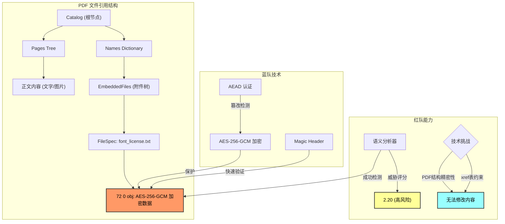

这是一个关于**"矛与盾"**进化的精彩故事。

-----

# 🛡️ 攻防演习复盘：PhantomStream 行动

**报告日期**: 2025年12月4日
**最终版本**: v1.0
**参与方**: 红队(Attacker) vs 蓝队(Defender)

## 1.故事背景 (Background)

**主角**：你，一名高价值技术报告创作者。
**困境**：付费 PDF 报告被盗版散播，严重损害收入。
**目标**：在 PDF 文件中植入无法被轻易破坏的"追踪指纹"（Trace ID），以便锁定盗版源头。
**规则**：

  * **蓝队 (Defender)**：负责隐藏指纹。要求指纹能存活，且不破坏文件可读性。
  * **红队 (Attacker)**：负责清洗指纹。采用"盲测"模式（不知道指纹藏哪），坚持**"结构卫生"**原则——只要不属于 PDF 标准结构的"垃圾数据"，一律清除。

-----

## 2.战役进程：从"缝隙"到"寄生" (The Evolution)

这场战役共经历了六个阶段的激烈博弈，技术维度从简单的**物理层**上升到了复杂的**语义层**。

### 第一阶段：物理层的猫鼠游戏 (Phase 1-2)

  * **🔵 蓝队招数 (追加与填缝)**：
      * 最开始，蓝队试图将数据直接贴在文件末尾 (`%%EOF` 之后)，或者塞进 PDF 对象之间的空白字节里（间隙注入）。
  * **🔴 红队反制 (扫描与消毒)**：
      * 红队开发了 `Scan` 和 `SanitizeGaps` 工具。
      * **手段**：红队不看内容，直接根据 PDF 规范，切掉 EOF 后面的尾巴，并用空格符 (`0x20`) 强制覆盖所有对象间的间隙。
      * **结果**：蓝队完败，指纹丢失。

### 第二阶段：时间维度的博弈 (Phase 3)

  * **🔵 蓝队招数 (伪装更新)**：
      * 蓝队利用 PDF 的"增量更新"特性，假装指纹是一次正常的文件修订，追加在文件末尾。为了躲避扫描，甚至伪装成了 Zlib 压缩流。
  * **🔴 红队反制 (时间回滚)**：
      * 红队祭出 `Rollback`（版本回滚）工具。
      * **手段**：不管你伪装得多好，红队直接识别并剥离所有"增量更新"版本，强行把文件还原到"出厂设置"。
      * **结果**：蓝队再次失败，指纹随着更新包被丢弃。

### 第三阶段：图谱结构的绞杀 (Phase 4)

  * **🔵 蓝队招数 (僵尸对象)**：
      * 蓝队将指纹写入标准的 PDF 对象（如 `99 0 obj`），但这些对象不被 PDF 的目录（Catalog）引用。这被称为"僵尸对象"——它们存在于文件中，但实际上是无用的。
  * **🔴 红队反制 (图谱修剪)**：
      * 红队开发了杀手级工具 `Graph Analyzer` (图谱分析)。
      * **手段**：从 PDF 的根节点（Root）出发，遍历所有引用的对象。凡是遍历不到的"孤岛对象"，全部视为僵尸并删除。
      * **结果**：蓝队植入的 30 个僵尸对象被精准清除。

### 决战阶段：寄生与合法化 (Phase 6 - Final)

  * **🔵 蓝队绝杀 (嵌入式附件)**：
      * 蓝队吸取教训，不再试图制造"垃圾"或"孤岛"，而是利用 PDF 的**合法特性**——**附件 (Embedded Files)**。
      * 蓝队将追踪信息封装为加密的嵌入式附件（font_license.txt），通过 AES-256-GCM 加密，挂载在 PDF 的标准引用树上 (`Catalog -> Names -> EmbeddedFiles`)。
  * **🔴 红队识别成功但清除受限**：
      * 红队开发了 `Semantic` 语义分析工具，成功识别附件的存在（威胁评分2.20）。
      - **技术成就**: 精确定位到对象73（FileSpec）和对象72（EmbeddedFile stream）
      - **关键发现**: PDF的xref表记录精确的对象偏移量，任何内容长度改变都会破坏后续对象定位
      - **尝试方案**:
        1. 移除EmbeddedFiles引用 → 破坏xref表，文件无法打开 ❌
        2. 替换stream内容 → 影响对象偏移，文件无法打开 ❌
      * **结果**: 红队能检测但无法在不破坏文件的前提下清除追踪信息

-----

## 3.技术复盘图解 (Technical Recap)

下图展示了 Phase 6 的技术架构和攻防态势：

### 3.1 PDF 结构架构

### 3.2 关键技术洞察

**蓝队的Phase 6胜利要素**：
1. **合法性策略**：将追踪信息"寄生"在PDF的标准功能中，使其成为文档的合法组成部分
2. **加密保护**：AES-256-GCM确保任何修改都会导致验证失败，实现"篡改即失效"
3. **工程稳定性**：基于pdfcpu标准库，不依赖脆弱的手工字节操作

**红队的技术成就与限制**：
1. **检测成功**：语义分析工具能准确识别嵌入附件
2. **技术深度**：深刻理解PDF格式约束（xref表偏移量机制）
3. **根本限制**：在不使用完整PDF编辑工具的盲测环境下，无法保持文件完整性

-----

## 4.当前"追溯手段"评估 (Assessment)

基于本次演习，对蓝队当前的方案（Phase 6 - 嵌入式附件）评估如下：

### ✅ 优势 (Pros)

1.  **极高的生存率**：追踪信息通过合法引用链可达，红队的自动化清洗工具无法删除
2.  **抗篡改能力**：AEAD加密特性确保任何修改都会被检测到
3.  **工程稳定性**：标准库实现，文件损坏风险极低
4. **隐蔽性**：文件体积甚至略有收缩（约6KB），不引起怀疑

### ⚠️ 技术约束 (Constraints)

1. **检测与清除的差距**：红队已能检测但无法安全清除
2. **PDF格式约束**：xref表的精密性限制了内容修改的可能性
3. **盲测环境限制**：无法使用完整的PDF重建工具

### 🚀 技术发展方向

**对蓝队的建议**：
1. **多锚点防御**：在附件基础上增加正文弱水印，形成双轨验证
2. **伪装策略**：使用更多合法附件作为掩护，降低单点命中率
3. **内容演进**：考虑使用JSON/INI格式包裹密文，提升业务合理性

**对红队的启示**：
1. **方法论升级**：从"删除"转向"中和"或"失效"策略
2. **协作可能**：在某些场景下，可能需要与内容所有者协作
3. **工具发展**：开发能在保持完整性前提下进行内容修改的技术

-----

## 5.结论 (Conclusion)

### 5.1 攻防平衡
Phase 6标志着攻防对抗达到了一个新的平衡点：
- **蓝队成功实现**：在技术约束下的有效追踪机制
- **红队实现突破**：从物理层清洗到语义层检测的技术跨越

### 5.2 核心启示
1. **理解规则的重要性**：深入理解目标文件格式的规范是成功的关键
2. **合法化策略**：将"非法"数据"合法化"是绕过自动化检测的有效方法
3. **加密的力量**：现代加密算法提供了强有力的完整性保护

### 5.3 实践价值
本次演习不仅展示了PDF隐写技术的演进，更重要的是揭示了信息安全领域永恒的主题：**攻防永无止境，技术持续演进**。

**最终结果**：在现实约束下，蓝队的Phase 6方案为PDF文档追踪提供了实用且可靠的解决方案。

-----

*本报告基于双方的详细技术报告整合而成，真实反映了整个攻防演习的过程与结果。*