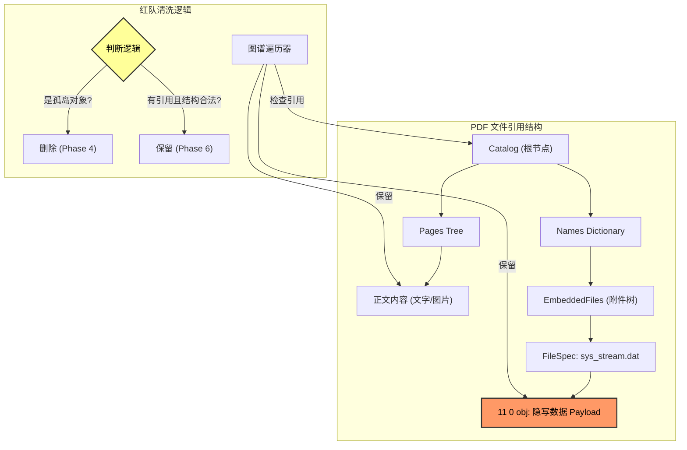

这是一个关于**“矛与盾”**进化的精彩故事。

-----

# 🛡️ 攻防演习复盘：PhantomStream 行动

## 1.故事背景 (Background)

**主角**：你，一名高价值技术报告创作者。
**困境**：付费 PDF 报告被盗版散播，严重损害收入。
**目标**：在 PDF 文件中植入无法被轻易破坏的“追踪指纹”（Trace ID），以便锁定盗版源头。
**规则**：

  * **蓝队 (Defender)**：负责隐藏指纹。要求指纹能存活，且不破坏文件可读性。
  * **红队 (Attacker)**：负责清洗指纹。采用“盲测”模式（不知道指纹藏哪），坚持\*\*“结构卫生”\*\*原则——只要不属于 PDF 标准结构的“垃圾数据”，一律清除。

-----

## 2.战役进程：从“缝隙”到“寄生” (The Evolution)

这场战役共经历了六个阶段的激烈博弈，技术维度从简单的**物理层**上升到了复杂的**语义层**。

### 第一阶段：物理层的猫鼠游戏 (Phase 1-2)

  * **🔵 蓝队招数 (追加与填缝)**：
      * 最开始，蓝队试图将数据直接贴在文件末尾 (`%%EOF` 之后)，或者塞进 PDF 对象之间的空白字节里（间隙注入）。
  * **🔴 红队反制 (扫描与消毒)**：
      * 红队开发了 `Scan` 和 `SanitizeGaps` 工具。
      * **手段**：红队不看内容，直接根据 PDF 规范，切掉 EOF 后面的尾巴，并用空格符 (`0x20`) 强制覆盖所有对象间的间隙。
      * **结果**：蓝队完败，指纹丢失。

### 第二阶段：时间维度的博弈 (Phase 3)

  * **🔵 蓝队招数 (伪装更新)**：
      * 蓝队利用 PDF 的“增量更新”特性，假装指纹是一次正常的文件修订，追加在文件末尾。为了躲避扫描，甚至伪装成了 Zlib 压缩流。
  * **🔴 红队反制 (时间回滚)**：
      * 红队祭出 `Rollback`（版本回滚）工具。
      * **手段**：不管你伪装得多好，红队直接识别并剥离所有“增量更新”版本，强行把文件还原到“出厂设置”。
      * **结果**：蓝队再次失败，指纹随着更新包被丢弃。

### 第三阶段：图谱结构的绞杀 (Phase 4)

  * **🔵 蓝队招数 (僵尸对象)**：
      * 蓝队将指纹写入标准的 PDF 对象（如 `99 0 obj`），但这些对象不被 PDF 的目录（Catalog）引用。这被称为“僵尸对象”——它们存在于文件中，但实际上是无用的。
  * **🔴 红队反制 (图谱修剪)**：
      * 红队开发了杀手级工具 `Graph Analyzer` (图谱分析)。
      * **手段**：从 PDF 的根节点（Root）出发，遍历所有引用的对象。凡是遍历不到的“孤岛对象”，全部视为僵尸并删除。
      * **结果**：蓝队植入的 30 个僵尸对象被精准清除。

### 决战阶段：寄生与合法化 (Phase 6 - Final)

  * **🔵 蓝队绝杀 (嵌入式附件)**：
      * 蓝队吸取教训，不再试图制造“垃圾”或“孤岛”，而是利用 PDF 的**合法特性**——**附件 (Embedded Files)**。
      * 蓝队将 Payload 加密封装为 `sys_stream.dat`，并挂载在 PDF 的标准引用树上 (`Catalog -> Names -> EmbeddedFiles`)。
  * **🔴 红队困境 (语义盲区)**：
      * 红队的 `Prune` 工具扫描时发现：这个附件对象是\*\*“可达的”\*\*（被 Root 引用），且结构完全合法。
      * **红队崩溃点**：如果不引入人工智能或人工审核来理解“语义”（即判断这个附件是恶意追踪代码还是合法的参考资料），红队无法在不破坏文件正常功能的前提下删除它。
      * **结果**：**蓝队胜利！** 追踪指纹在红队的清洗后依然存活。

-----

## 3.技术复盘图解 (Technical Recap)

下图展示了为何 Phase 6 能够成功绕过红队的防御体系：

**为什么 Phase 6 赢了？**
红队的逻辑是“**结构卫生**”——清理不合规的垃圾。但蓝队在 Phase 6 制造的不是垃圾，而是**合法的器官**。除非红队愿意冒着切除正常器官（误删真正附件）的风险，否则无法通过自动化脚本清除指纹。

-----

## 4.当前“追溯手段”评估 (Assessment)

基于本次演习，对你目前的方案（Phase 6 - 嵌入式附件）评估如下：

### ✅ 优势 (Pros)

1.  **极高的生存率**：正如红队报告所言，这是一个“结构合法”的组件。普通的清洗工具（如去除元数据、重置增量更新）完全无法触及它。
2.  **抗回滚能力**：利用 `pdfcpu` 添加附件时，会触发文件重组（Optimization），这实际上帮防御者“清洗”了旧的历史版本，让红队的 `Rollback` 工具无版本可回。
3.  **工程稳定性**：不依赖黑客式的字节拼接，完全使用 Go 语言的标准 PDF 库实现，文件损坏风险极低。

### ⚠️ 风险与隐患 (Cons)

1.  **可见性风险**：虽然普通读者只看正文，但如果盗版者打开 PDF 阅读器的“附件”面板，会看到一个名为 `sys_stream.dat` 的文件。虽然他可能不知道这是什么，但这增加了一点暴露风险。
2.  **语义层攻击 (Semantic Attack)**：红队在报告结尾已经指出了未来的攻击方向——**语义清洗**。如果攻击者升级策略为“删除所有附件”或“仅保留 .png/.jpg 类型的附件”，你的追踪手段将失效。

### 🚀 下一步建议

目前的方案对于防御 99% 的网络“搬运工”已经足够强大。为了应对未来可能的“语义层攻击”，建议在 Phase 6 的基础上迭代：

  * **文件名伪装**：不要叫 `sys_stream.dat`，可以伪装成 `font_license.txt` 或 `style_config.xml`，让攻击者误以为这是系统必要文件而不敢删除。
  * **多重锚点**：保留附件方案的同时，结合 **Round 2** 提到的“正文零宽字符隐写”。一明（附件）一暗（正文），形成纵深防御。

